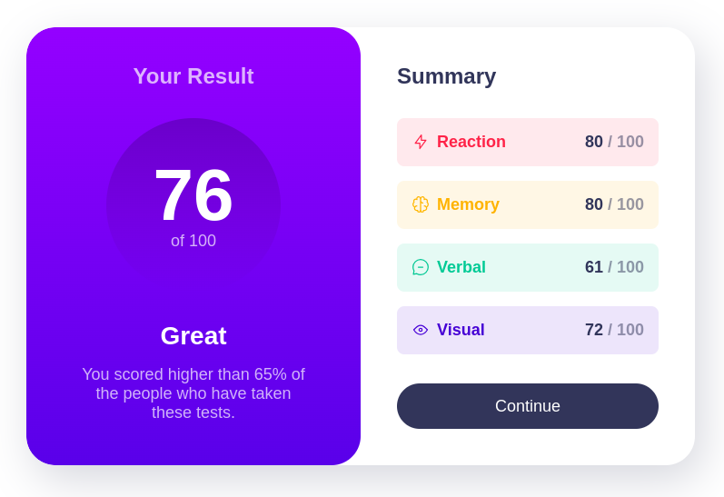
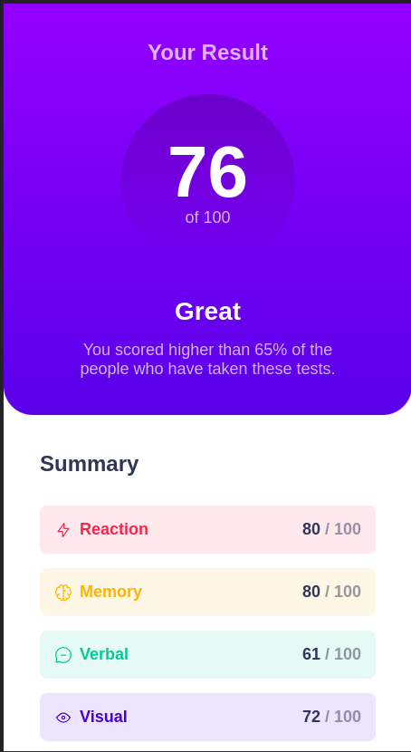

# Frontend Mentor - Results summary component solution

This is a solution to the [Results summary component challenge on Frontend Mentor](https://www.frontendmentor.io/challenges/results-summary-component-CE_K6s0maV). Frontend Mentor challenges help you improve your coding skills by building realistic projects. 

## Table of contents

- [Overview](#overview)
  - [The challenge](#the-challenge)
  - [Screenshot](#screenshot)
  - [Links](#links)
- [My process](#my-process)
  - [Built with](#built-with)
- [Author](#author)
- [Acknowledgments](#acknowledgments)

**Note: Delete this note and update the table of contents based on what sections you keep.**

## Overview

### The challenge

Users should be able to:

- View the optimal layout for the interface depending on their device's screen size
- See hover and focus states for all interactive elements on the page
- **Bonus**: Use the local JSON data to dynamically populate the content

### Screenshot

#### Desktop View

#### Mobile View

### Links

- Solution URL: [here](https://github.com/archihalder/fm-result-summary-component)
- Live Site URL: [here](https://archihalder.github.io/fm-result-summary-component/)

## My process

### Built with

- Semantic HTML5 markup
- CSS custom properties
- Flexbox
- CSS Grid

## Author

- Website - [Archi Halder](https://archihalder.github.io/portfolio/)
- Frontend Mentor - [@archihalder](https://www.frontendmentor.io/profile/archihalder)
- Twitter - [@archi_halder](https://twitter.com/archi_halder)

## Acknowledgments

I created this project with the help of a YouTube video from Kevin Powell. The link to the video is [here](https://youtu.be/KqFAs5d3Yl8).
